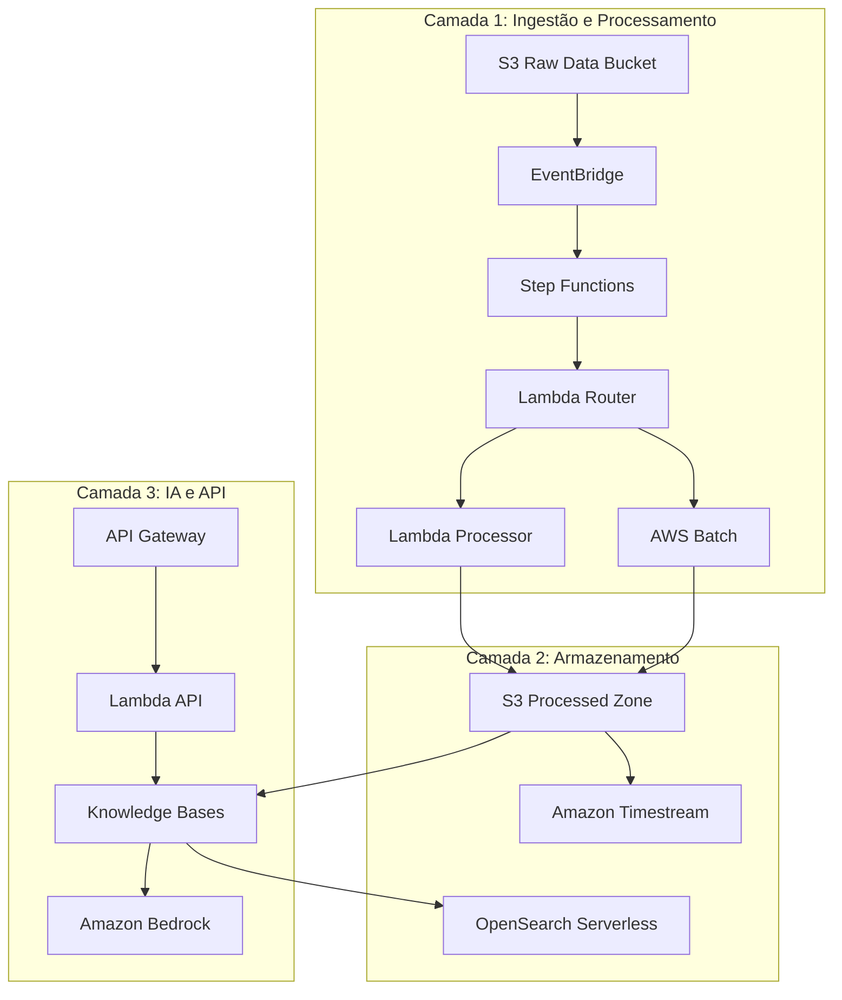
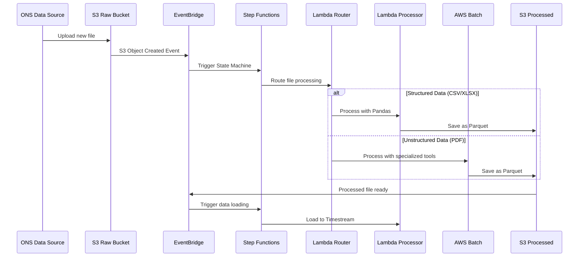

# Design Document

## Overview

A plataforma ONS Data Platform é uma solução serverless na AWS que implementa uma arquitetura orientada a eventos para processar dados abertos do setor elétrico brasileiro. A solução utiliza uma abordagem de três camadas: Ingestão e Processamento, Armazenamento e Análise, e IA/API, todas orquestradas através de serviços gerenciados da AWS para garantir escalabilidade, confiabilidade e custo-efetividade.

## Architecture

### High-Level Architecture



### Event-Driven Processing Flow



## Components and Interfaces

### 1. Data Ingestion Layer

#### EventBridge Rules
- **Purpose**: Capture S3 object creation events and route to appropriate processors
- **Configuration**: 
  - Source: `aws.s3`
  - Event Pattern: `{"source": ["aws.s3"], "detail-type": ["Object Created"]}`
  - Target: Step Functions State Machine

#### Step Functions State Machine
- **Purpose**: Orchestrate the entire ETL pipeline with error handling and retry logic
- **States**:
  - **Route**: Determine processing path based on file metadata
  - **ProcessStructured**: Handle CSV/XLSX files via Lambda
  - **ProcessUnstructured**: Handle PDF files via Batch
  - **LoadToTimestream**: Load processed data to time series database
  - **UpdateKnowledgeBase**: Sync data with RAG system
- **Error Handling**: Exponential backoff retry with dead letter queue

#### Lambda Router Function
```python
# Interface specification
def lambda_handler(event, context):
    """
    Routes files to appropriate processing based on:
    - File extension (.csv, .xlsx, .pdf)
    - File size (>100MB goes to Batch)
    - Content type metadata
    """
    return {
        'processingType': 'lambda|batch',
        'processorConfig': {...},
        'outputLocation': 's3://processed-bucket/...'
    }
```

#### Lambda Processor Function
- **Runtime**: Python 3.11
- **Memory**: 3008 MB (maximum for CPU optimization)
- **Timeout**: 15 minutes
- **Libraries**: pandas, pyarrow, boto3, aws-data-wrangler
- **Processing Logic**:
  - Data validation and cleaning
  - Schema standardization
  - Parquet conversion with optimal partitioning

#### AWS Batch Jobs
- **Compute Environment**: Fargate Spot for cost optimization
- **Job Definition**: 
  - Container: Custom Docker image with Python + specialized libraries
  - vCPU: 2-4 (auto-scaling based on file size)
  - Memory: 8-16 GB
- **Libraries**: Camelot, Tabula, PyPDF2, pandas, pyarrow

### 2. Storage Layer

#### S3 Data Lake Architecture
```
s3://ons-data-platform/
├── raw/                    # Original files from ONS
│   ├── year=2024/
│   └── year=2025/
├── processed/              # Parquet files
│   ├── dataset=generation/
│   │   ├── year=2024/
│   │   └── month=01/
│   └── dataset=consumption/
└── failed/                 # Failed processing files
```

- **Partitioning Strategy**: By dataset type, year, and month for optimal query performance
- **Storage Classes**: 
  - Raw: Standard (frequent access for processing)
  - Processed: Standard-IA after 30 days, Glacier after 1 year
- **Lifecycle Policies**: Automated transition to reduce costs

#### Amazon Timestream Database
- **Database**: `ons_energy_data`
- **Tables**:
  - `generation_data`: Power generation metrics by source
  - `consumption_data`: Energy consumption by region
  - `transmission_data`: Grid transmission statistics
- **Retention**: 
  - Memory: 24 hours (hot data)
  - Magnetic: 7 years (warm data)
- **Dimensions**: timestamp, region, energy_source, measurement_type
- **Measures**: value, unit, quality_flag

#### OpenSearch Serverless (Vector Database)
- **Collection**: `ons-knowledge-base`
- **Index Strategy**: Separate indices for different data types
- **Vector Dimensions**: 1536 (Amazon Titan Embeddings)
- **Security**: IAM-based access control with VPC endpoints

### 3. AI and API Layer

#### API Gateway Configuration
- **Type**: REST API with regional endpoint
- **Authentication**: API Key + IAM roles
- **Throttling**: 
  - Burst: 2000 requests
  - Rate: 1000 requests/second
- **Endpoints**:
  - `POST /query` - Natural language queries
  - `GET /health` - Health check
  - `GET /metrics` - Usage statistics

#### Lambda API Function
```python
# Interface specification
def lambda_handler(event, context):
    """
    Process natural language queries:
    1. Validate input
    2. Call Knowledge Base
    3. Format response
    4. Log interaction
    """
    return {
        'answer': str,
        'sources': List[str],
        'confidence': float,
        'query_id': str
    }
```

#### Knowledge Bases for Amazon Bedrock
- **Data Source**: S3 processed zone (Parquet files)
- **Embedding Model**: Amazon Titan Embeddings G1 - Text
- **LLM Model**: Anthropic Claude 3.5 Sonnet
- **Chunking Strategy**: 
  - Size: 300 tokens
  - Overlap: 20%
- **Retrieval Configuration**:
  - Top-k: 5 relevant chunks
  - Score threshold: 0.7

## Data Models

### Raw Data Schema (Input)
```json
{
  "file_metadata": {
    "source": "ONS",
    "file_type": "csv|xlsx|pdf",
    "upload_timestamp": "ISO8601",
    "file_size_bytes": "integer",
    "checksum": "string"
  }
}
```

### Processed Data Schema (Parquet)
```json
{
  "timestamp": "timestamp",
  "dataset_type": "generation|consumption|transmission",
  "region": "string",
  "energy_source": "string",
  "measurement_type": "string",
  "value": "float",
  "unit": "string",
  "quality_flag": "string",
  "processing_metadata": {
    "processed_at": "timestamp",
    "processor_version": "string",
    "source_file": "string"
  }
}
```

### API Response Schema
```json
{
  "query_id": "uuid",
  "question": "string",
  "answer": "string",
  "confidence_score": "float",
  "sources": [
    {
      "document": "string",
      "relevance_score": "float",
      "excerpt": "string"
    }
  ],
  "processing_time_ms": "integer",
  "timestamp": "ISO8601"
}
```

## Error Handling

### Processing Errors
- **File Format Errors**: Route to manual review queue with SNS notification
- **Data Quality Issues**: Log warnings but continue processing with quality flags
- **Timeout Errors**: Automatic retry with exponential backoff (3 attempts)
- **Resource Limits**: Scale up Batch compute or split large files

### API Errors
- **Rate Limiting**: Return 429 with retry-after header
- **Authentication**: Return 401 with clear error message
- **Invalid Queries**: Return 400 with validation details
- **Service Unavailable**: Return 503 with estimated recovery time

### Monitoring and Alerting
- **CloudWatch Alarms**:
  - Processing failure rate > 5%
  - API latency > 10 seconds
  - Cost anomalies > 20% increase
- **SNS Topics**: Critical alerts to operations team
- **Dead Letter Queues**: Failed messages for manual investigation

## Testing Strategy

### Unit Testing
- **Lambda Functions**: pytest with moto for AWS service mocking
- **Data Processing**: pandas testing utilities for data validation
- **API Logic**: FastAPI test client for endpoint testing
- **Coverage Target**: 90% code coverage

### Integration Testing
- **End-to-End**: Automated tests with sample ONS files
- **Performance**: Load testing with realistic data volumes
- **Error Scenarios**: Chaos engineering with fault injection
- **Security**: OWASP ZAP for API security testing

### Infrastructure Testing
- **Terraform**: terratest for infrastructure validation
- **Security**: Checkov for compliance scanning
- **Cost**: AWS Cost Explorer integration for budget validation
- **Disaster Recovery**: Regular backup and restore testing

### Deployment Strategy
- **Blue-Green Deployment**: Zero-downtime updates using AWS CodeDeploy
- **Canary Releases**: Gradual rollout with automatic rollback on errors
- **Feature Flags**: AWS AppConfig for controlled feature activation
- **Rollback Plan**: Automated rollback triggers based on error rates and latency