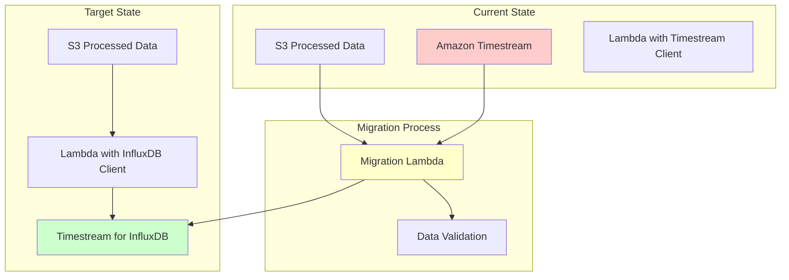
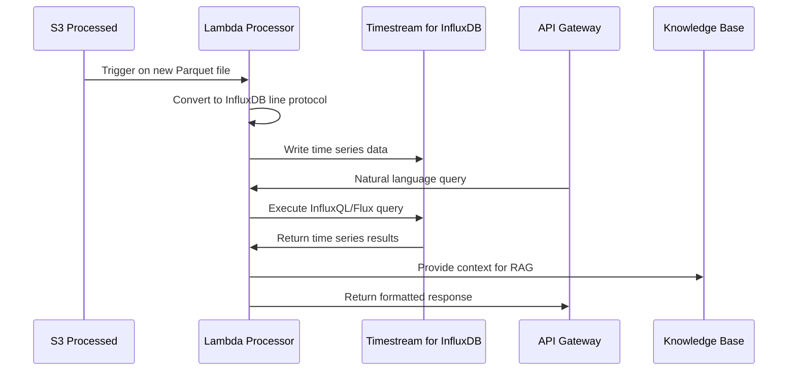

# Design Document

## Overview

The Timestream for InfluxDB migration transforms the ONS data platform's time series storage from Amazon Timestream to Amazon Timestream for InfluxDB. This migration maintains all existing functionality while providing better AWS service accessibility, enhanced query capabilities through InfluxQL and Flux, and improved integration with the broader InfluxDB ecosystem. The design ensures zero data loss, minimal downtime, and backward compatibility with existing API endpoints.

## Architecture

### High-Level Migration Architecture



### Data Flow Architecture



## Components and Interfaces

### 1. Amazon Timestream for InfluxDB Cluster

#### Cluster Configuration
```yaml
# Terraform configuration structure
resource "aws_timestreaminfluxdb_db_instance" "ons_influxdb" {
  allocated_storage     = 20
  apply_immediately    = true
  auto_minor_version_upgrade = true
  availability_zone    = "us-east-1a"
  backup_retention_period = 7
  backup_window       = "03:00-04:00"
  db_instance_type    = "db.influx.medium"
  db_name            = "ons_energy_data"
  db_parameter_group_name = "default.influxdb"
  engine             = "influxdb"
  engine_version     = "2.0.x"
  maintenance_window = "sun:04:00-sun:05:00"
  publicly_accessible = false
  storage_encrypted   = true
  vpc_security_group_ids = [aws_security_group.influxdb.id]
  db_subnet_group_name = aws_db_subnet_group.influxdb.name
}
```

#### Database Schema Design
```
Organization: ons-energy
Buckets:
├── generation_data/        # Power generation metrics
│   ├── Retention: 7 years
│   └── Measurements: power_mw, capacity_factor, availability
├── consumption_data/       # Energy consumption data  
│   ├── Retention: 7 years
│   └── Measurements: consumption_mwh, demand_mw, load_factor
└── transmission_data/      # Grid transmission statistics
    ├── Retention: 7 years
    └── Measurements: flow_mw, losses_mwh, voltage_kv
```

#### InfluxDB Line Protocol Format
```
# Example data point format
generation_data,region=southeast,source=hydro,plant=itaipu power_mw=14000,capacity_factor=0.85,availability=0.98 1640995200000000000
consumption_data,region=southeast,sector=industrial consumption_mwh=1250.5,demand_mw=890.2 1640995200000000000
transmission_data,line=north_southeast,voltage=500kv flow_mw=2500,losses_mwh=45.2 1640995200000000000
```

### 2. Lambda Function Updates

#### InfluxDB Client Integration
```python
# Lambda function interface for InfluxDB integration
import influxdb_client
from influxdb_client.client.write_api import SYNCHRONOUS

class InfluxDBHandler:
    def __init__(self):
        self.client = influxdb_client.InfluxDBClient(
            url=os.environ['INFLUXDB_URL'],
            token=os.environ['INFLUXDB_TOKEN'],
            org=os.environ['INFLUXDB_ORG']
        )
        self.write_api = self.client.write_api(write_options=SYNCHRONOUS)
        self.query_api = self.client.query_api()
    
    def write_parquet_to_influx(self, parquet_data):
        """Convert Parquet data to InfluxDB line protocol and write"""
        points = []
        for _, row in parquet_data.iterrows():
            point = Point(row['measurement_type']) \
                .tag("region", row['region']) \
                .tag("energy_source", row['energy_source']) \
                .field("value", row['value']) \
                .field("unit", row['unit']) \
                .time(row['timestamp'])
            points.append(point)
        
        self.write_api.write(bucket="energy_data", record=points)
    
    def query_time_series(self, flux_query):
        """Execute Flux query and return results"""
        result = self.query_api.query(flux_query)
        return self._format_query_results(result)
```

#### Data Processing Pipeline
```python
def lambda_handler(event, context):
    """
    Enhanced Lambda handler for InfluxDB integration
    """
    try:
        # Initialize InfluxDB handler
        influx_handler = InfluxDBHandler()
        
        # Process S3 event
        for record in event['Records']:
            bucket = record['s3']['bucket']['name']
            key = record['s3']['object']['key']
            
            # Read Parquet file from S3
            parquet_data = read_parquet_from_s3(bucket, key)
            
            # Validate and clean data
            cleaned_data = validate_and_clean(parquet_data)
            
            # Write to InfluxDB
            influx_handler.write_parquet_to_influx(cleaned_data)
            
            # Update processing metadata
            update_processing_status(key, 'completed')
            
        return {'statusCode': 200, 'body': 'Processing completed'}
        
    except Exception as e:
        logger.error(f"Processing failed: {str(e)}")
        # Send to DLQ for retry
        send_to_dlq(event, str(e))
        raise
```

### 3. Query Interface Layer

#### Natural Language to InfluxDB Query Translation
```python
class QueryTranslator:
    def __init__(self):
        self.query_templates = {
            'generation_trend': '''
                from(bucket: "generation_data")
                |> range(start: {start_time}, stop: {stop_time})
                |> filter(fn: (r) => r["_measurement"] == "power_mw")
                |> filter(fn: (r) => r["region"] == "{region}")
                |> aggregateWindow(every: 1h, fn: mean)
            ''',
            'consumption_peak': '''
                from(bucket: "consumption_data")
                |> range(start: {start_time}, stop: {stop_time})
                |> filter(fn: (r) => r["_measurement"] == "demand_mw")
                |> max()
            ''',
            'transmission_losses': '''
                from(bucket: "transmission_data")
                |> range(start: {start_time}, stop: {stop_time})
                |> filter(fn: (r) => r["_measurement"] == "losses_mwh")
                |> sum()
            '''
        }
    
    def translate_natural_language(self, question, context):
        """Convert natural language to Flux query"""
        # Use LLM to identify query type and parameters
        query_type = self._identify_query_type(question)
        parameters = self._extract_parameters(question, context)
        
        # Generate Flux query from template
        flux_query = self.query_templates[query_type].format(**parameters)
        return flux_query
```

#### API Gateway Integration
```python
def api_lambda_handler(event, context):
    """
    API Gateway handler with InfluxDB query support
    """
    try:
        # Parse request
        body = json.loads(event['body'])
        question = body['question']
        
        # Initialize components
        influx_handler = InfluxDBHandler()
        translator = QueryTranslator()
        
        # Translate natural language to Flux query
        flux_query = translator.translate_natural_language(question, {})
        
        # Execute query
        results = influx_handler.query_time_series(flux_query)
        
        # Generate response using Knowledge Base
        kb_response = generate_kb_response(question, results)
        
        return {
            'statusCode': 200,
            'body': json.dumps({
                'answer': kb_response['answer'],
                'sources': kb_response['sources'],
                'time_series_data': results,
                'query_used': flux_query
            })
        }
        
    except Exception as e:
        return {
            'statusCode': 500,
            'body': json.dumps({'error': str(e)})
        }
```

### 4. Migration Strategy

#### Data Migration Process


#### Migration Lambda Function
```python
class TimestreamMigrator:
    def __init__(self):
        self.timestream_client = boto3.client('timestream-query')
        self.influx_handler = InfluxDBHandler()
    
    def migrate_data(self, start_date, end_date):
        """Migrate data from Timestream to InfluxDB"""
        
        # Query all data from Timestream
        timestream_query = f"""
            SELECT * FROM "ons_energy_data"."generation_data"
            WHERE time BETWEEN '{start_date}' AND '{end_date}'
        """
        
        response = self.timestream_client.query(QueryString=timestream_query)
        
        # Convert to InfluxDB format
        influx_points = []
        for row in response['Rows']:
            point = self._convert_timestream_row_to_influx(row)
            influx_points.append(point)
        
        # Batch write to InfluxDB
        batch_size = 1000
        for i in range(0, len(influx_points), batch_size):
            batch = influx_points[i:i + batch_size]
            self.influx_handler.write_api.write(
                bucket="generation_data", 
                record=batch
            )
        
        # Validate migration
        return self._validate_migration(start_date, end_date)
```

## Data Models

### InfluxDB Data Structure
```json
{
  "measurement": "generation_data",
  "tags": {
    "region": "southeast",
    "energy_source": "hydro",
    "plant_name": "itaipu",
    "operator": "ons"
  },
  "fields": {
    "power_mw": 14000.5,
    "capacity_factor": 0.85,
    "availability": 0.98,
    "efficiency": 0.92
  },
  "timestamp": "2024-01-01T12:00:00Z"
}
```

### API Response Schema (Enhanced)
```json
{
  "query_id": "uuid",
  "question": "string",
  "answer": "string",
  "confidence_score": 0.95,
  "time_series_data": [
    {
      "timestamp": "2024-01-01T12:00:00Z",
      "measurement": "power_mw",
      "value": 14000.5,
      "tags": {
        "region": "southeast",
        "source": "hydro"
      }
    }
  ],
  "flux_query_used": "from(bucket: \"generation_data\")...",
  "sources": [
    {
      "document": "generation_report_2024.parquet",
      "relevance_score": 0.92,
      "time_range": "2024-01-01 to 2024-01-31"
    }
  ],
  "processing_time_ms": 245,
  "timestamp": "2024-01-01T12:00:05Z"
}
```

## Error Handling

### InfluxDB Connection Management
- **Connection Pooling**: Maintain persistent connections with automatic retry
- **Circuit Breaker**: Fail fast when InfluxDB is unavailable
- **Fallback Strategy**: Query S3 directly if InfluxDB is down
- **Health Checks**: Regular connectivity and performance monitoring

### Data Integrity Validation
- **Write Verification**: Confirm successful writes with read-back validation
- **Duplicate Detection**: Handle duplicate timestamps and measurements
- **Schema Validation**: Ensure data conforms to expected InfluxDB schema
- **Rollback Capability**: Ability to revert to previous data state

### Query Error Handling
```python
def execute_flux_query_with_retry(query, max_retries=3):
    """Execute Flux query with exponential backoff retry"""
    for attempt in range(max_retries):
        try:
            result = influx_client.query_api.query(query)
            return result
        except InfluxDBError as e:
            if attempt == max_retries - 1:
                raise
            wait_time = 2 ** attempt
            time.sleep(wait_time)
            logger.warning(f"Query retry {attempt + 1}/{max_retries} after {wait_time}s")
```

## Testing Strategy

### Migration Testing
- **Data Integrity Tests**: Compare Timestream vs InfluxDB query results
- **Performance Benchmarks**: Measure query latency and throughput
- **Load Testing**: Simulate high-volume data ingestion
- **Rollback Testing**: Verify ability to revert migration

### Integration Testing
- **End-to-End Workflows**: Test complete data pipeline with InfluxDB
- **API Compatibility**: Ensure existing API contracts remain unchanged
- **Knowledge Base Integration**: Verify RAG functionality with time series data
- **Error Scenarios**: Test failure modes and recovery procedures

### Performance Validation
```python
def performance_test_suite():
    """Comprehensive performance testing for InfluxDB migration"""
    
    tests = [
        {
            'name': 'High-frequency writes',
            'test': lambda: write_test_data(points_per_second=10000, duration=60),
            'expected_latency': '<100ms p95'
        },
        {
            'name': 'Complex aggregation queries',
            'test': lambda: run_aggregation_queries(time_range='30d'),
            'expected_latency': '<5s p95'
        },
        {
            'name': 'Concurrent read/write',
            'test': lambda: concurrent_operations(readers=10, writers=5),
            'expected_throughput': '>5000 ops/sec'
        }
    ]
    
    return execute_performance_tests(tests)
```

## Deployment Strategy

### Blue-Green Migration Approach
1. **Blue Environment**: Current Timestream setup (production)
2. **Green Environment**: New InfluxDB setup (staging)
3. **Data Sync**: Continuous replication from Blue to Green
4. **Validation**: Comprehensive testing in Green environment
5. **Traffic Switch**: Gradual migration of API traffic
6. **Monitoring**: Real-time comparison of performance metrics
7. **Rollback Plan**: Immediate switch back to Blue if issues occur

### Infrastructure as Code Updates
```hcl
# Terraform module for InfluxDB deployment
module "timestream_influxdb" {
  source = "./modules/timestream-influxdb"
  
  instance_type = "db.influx.large"
  storage_size  = 100
  backup_retention = 7
  
  vpc_id     = var.vpc_id
  subnet_ids = var.private_subnet_ids
  
  security_group_rules = [
    {
      type        = "ingress"
      from_port   = 8086
      to_port     = 8086
      protocol    = "tcp"
      cidr_blocks = [var.vpc_cidr]
    }
  ]
  
  tags = {
    Environment = var.environment
    Project     = "ons-data-platform"
    Component   = "timestream-influxdb"
  }
}
```

### Monitoring and Observability
- **CloudWatch Metrics**: InfluxDB performance, connection counts, query latency
- **Custom Dashboards**: Real-time visualization of migration progress
- **Alerting**: Automated notifications for performance degradation
- **Cost Tracking**: Detailed cost comparison between Timestream and InfluxDB