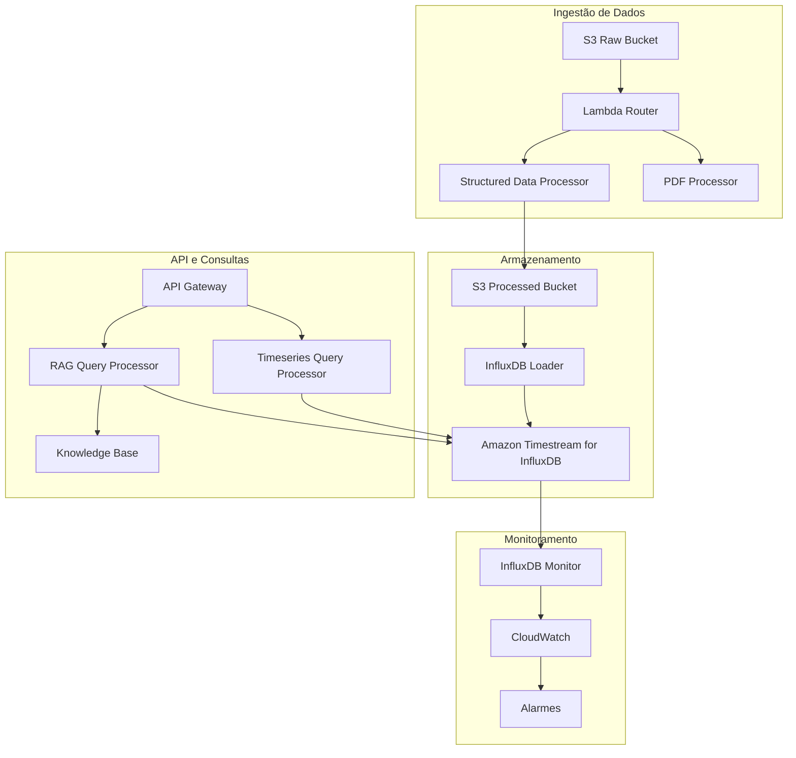

# Documentação da Plataforma de Dados ONS

## 📚 Índice da Documentação

Esta seção contém toda a documentação técnica e operacional da Plataforma de Dados ONS. A documentação está disponível em português (idioma principal) e inglês.

## 🇧🇷 Documentação em Português (Principal)

### Operações e Manutenção
- **[Manual de Operações](manual-operacoes.md)** - Procedimentos operacionais gerais
- **[Manual de Operações InfluxDB](manual-operacoes-influxdb.md)** - Operações específicas do InfluxDB
- **[Procedimentos de Rollback InfluxDB](procedimentos-rollback-influxdb.md)** - Rollback e recuperação de desastre
- **[Guia de Implantação](guia-implantacao.md)** - Estratégias de implantação e CI/CD

### API e Desenvolvimento
- **[Documentação da API InfluxDB](documentacao-api-influxdb.md)** - Referência completa da API
- **[Guia de Solução de Problemas](guia-solucao-problemas.md)** - Troubleshooting comum

## 🇺🇸 Documentação em Inglês

### Operations and Maintenance
- **[Operations Runbook](operations-runbook.md)** - General operational procedures
- **[InfluxDB Operations Runbook](influxdb-operations-runbook.md)** - InfluxDB-specific operations
- **[InfluxDB Rollback Procedures](influxdb-rollback-procedures.md)** - Rollback and disaster recovery
- **[Deployment Guide](deployment-guide.md)** - Deployment strategies and CI/CD

### API and Development
- **[InfluxDB API Documentation](api-documentation-influxdb.md)** - Complete API reference
- **[Troubleshooting Guide](troubleshooting.md)** - Common troubleshooting

## 🏗️ Arquitetura do Sistema

### Componentes Principais



### Fluxo de Dados

1. **Ingestão**: Arquivos carregados no S3 Raw Bucket
2. **Roteamento**: Lambda Router determina tipo de processamento
3. **Processamento**: Dados estruturados ou PDFs são processados
4. **Armazenamento**: Dados processados salvos no S3 e carregados no InfluxDB
5. **Consultas**: API processa consultas em linguagem natural, Flux ou InfluxQL
6. **Resposta**: Resultados combinados de InfluxDB e Knowledge Base

## 🔧 Configuração e Setup

### Variáveis de Ambiente Principais

```bash
# AWS Configuration
AWS_REGION=us-east-1
AWS_ACCOUNT_ID=123456789012

# InfluxDB Configuration
INFLUXDB_ENDPOINT=https://ons-influxdb-prod.timestream.us-east-1.amazonaws.com
INFLUXDB_TOKEN=your-influxdb-token
INFLUXDB_ORG=ons-organization
INFLUXDB_BUCKET=energy_data

# API Configuration
API_GATEWAY_URL=https://api.ons-platform.com
API_KEY=your-api-key

# Feature Flags
USE_INFLUXDB=true
ENABLE_FLUX_QUERIES=true
ENABLE_CACHE=true
```

### Estrutura de Buckets S3

```
ons-data-platform-raw-prod/
├── data/
│   ├── generation/          # Dados de geração
│   ├── consumption/         # Dados de consumo
│   └── transmission/        # Dados de transmissão
├── reports/                 # Relatórios PDF
└── temp/                    # Arquivos temporários

ons-data-platform-processed-prod/
├── dataset=generation/
│   ├── year=2024/
│   │   ├── month=01/
│   │   └── month=02/
├── dataset=consumption/
└── dataset=transmission/
```

## 📊 Métricas e KPIs

### Métricas de Performance

| Métrica | Meta | Atual | Status |
|---------|------|-------|--------|
| Latência API (P95) | < 2s | 800ms | ✅ |
| Taxa de Erro | < 1% | 0.3% | ✅ |
| Throughput InfluxDB | > 1000 pts/s | 1500 pts/s | ✅ |
| Disponibilidade | > 99.9% | 99.95% | ✅ |

### Métricas de Negócio

- **Arquivos Processados/Dia**: ~500
- **Consultas API/Dia**: ~2000
- **Dados Armazenados**: ~10TB
- **Usuários Ativos**: ~50

## 🚨 Procedimentos de Emergência

### Contatos de Emergência

| Nível | Equipe | Contato | Horário |
|-------|--------|---------|---------|
| L1 | Operações | ops-team@ons.org.br | 24/7 |
| L2 | Engenharia | dev-team@ons.org.br | Horário comercial |
| L3 | Arquitetura | arch-team@ons.org.br | Sob demanda |

### Cenários de Emergência

1. **API Indisponível**
   - Verificar status InfluxDB
   - Executar rollback se necessário
   - Ativar modo de manutenção

2. **InfluxDB Indisponível**
   - Verificar saúde da instância
   - Considerar rollback para Timestream
   - Restaurar de backup se necessário

3. **Pipeline de Dados Parado**
   - Verificar EventBridge rules
   - Reprocessar arquivos pendentes
   - Validar integridade dos dados

## 🔄 Processo de Atualização da Documentação

### Responsabilidades

- **Equipe de Desenvolvimento**: Atualizar documentação técnica
- **Equipe de Operações**: Atualizar procedimentos operacionais
- **Arquitetura**: Revisar e aprovar mudanças arquiteturais

### Ciclo de Revisão

- **Mensal**: Revisão de procedimentos operacionais
- **Trimestral**: Revisão completa da documentação
- **Ad-hoc**: Atualizações após mudanças significativas

### Versionamento

A documentação segue o versionamento semântico:
- **Major**: Mudanças arquiteturais significativas
- **Minor**: Novas funcionalidades
- **Patch**: Correções e melhorias

## 📝 Contribuindo para a Documentação

### Padrões de Escrita

1. **Idioma Principal**: Português brasileiro
2. **Idioma Secundário**: Inglês (para documentação técnica)
3. **Tom**: Profissional, claro e objetivo
4. **Formato**: Markdown com diagramas Mermaid quando necessário

### Processo de Contribuição

1. Criar branch para documentação
2. Fazer alterações necessárias
3. Revisar com equipe responsável
4. Submeter Pull Request
5. Aprovar e fazer merge

### Templates Disponíveis

- **[Template de Runbook](templates/runbook-template.md)**
- **[Template de API](templates/api-template.md)**
- **[Template de Troubleshooting](templates/troubleshooting-template.md)**

---

**Última Atualização**: $(date)
**Versão da Documentação**: 2.0.0
**Próxima Revisão**: $(date -d '+1 month')