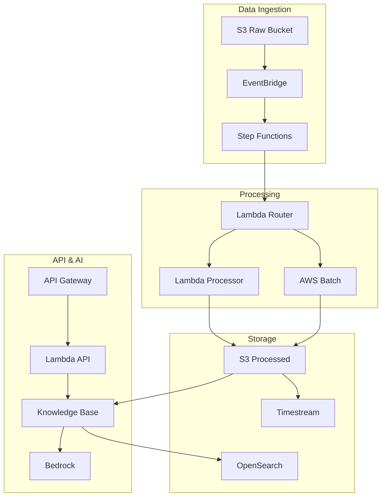

# Architecture Documentation

This document describes the overall system architecture and design decisions.

## System Overview

The ONS Data Platform is a serverless, event-driven system built on AWS that processes energy sector data and provides intelligent querying capabilities through a RAG system.

## Architecture Diagram

## Components

### Data Ingestion Layer

- **S3 Raw Bucket: Stores incoming data files from ONS**
- **EventBridge: Routes S3 events to processing workflows**
- **Step Functions: Orchestrates the entire processing pipeline**

### Processing Layer

- **Lambda Router: Routes files based on type and size**
- **Lambda Processor: Handles structured data (CSV, XLSX)**
- **AWS Batch: Processes unstructured data (PDF)**

### Storage Layer

- **S3 Processed: Stores processed data in Parquet format**
- **Timestream: Time series database for energy data**
- **OpenSearch: Vector database for semantic search**

### API & AI Layer

- **API Gateway: REST API endpoints**
- **Lambda API: Handles API requests**
- **Knowledge Base: RAG system for intelligent querying**
- **Bedrock: Large language model for answer generation**

## Design Decisions

### Serverless Architecture

Chosen for automatic scaling, cost efficiency, and reduced operational overhead

### Event-Driven Processing

Enables real-time processing and loose coupling between components

### Multi-Format Support

Different processing strategies for CSV/XLSX (Lambda) vs PDF (Batch) based on complexity

### RAG Implementation

Combines retrieval and generation for accurate, contextual responses

### Time Series Database

Timestream optimized for time-based energy data queries

