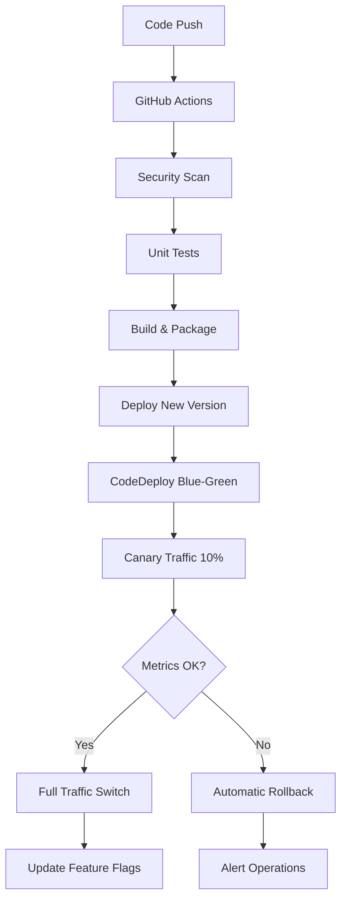

# Deployment and Rollback Guide

## Overview

This guide covers the blue-green deployment strategy implemented for the ONS Data Platform, including canary releases, feature flags, and automated rollback procedures.

## Architecture

### Blue-Green Deployment Components

1. **AWS CodeDeploy**: Manages blue-green deployments for Lambda functions
2. **AWS AppConfig**: Provides feature flags and configuration management
3. **CloudWatch Alarms**: Monitor error rates and latency for automatic rollback
4. **GitHub Actions**: Automated CI/CD pipeline with path-based triggers

### Deployment Flow



## Deployment Strategies

### 1. Canary Deployment (Default)

- **Traffic Split**: 10% to new version, 90% to current version
- **Duration**: 5 minutes monitoring period
- **Rollback Triggers**: 
  - Error rate > 5%
  - Average duration > 10 seconds
  - InfluxDB connection failures
  - CloudWatch alarms

### 2. All-at-Once Deployment (Emergency)

- **Use Case**: Critical bug fixes, security patches
- **Traffic Split**: 100% immediate switch
- **Monitoring**: Continuous health checks

### 3. Linear Deployment

- **Traffic Split**: Gradual increase (10%, 20%, 50%, 100%)
- **Duration**: 10 minutes per stage
- **Use Case**: Major feature releases

## Feature Flags

### Available Flags

1. **enable_new_api_endpoint**: Controls new API functionality
2. **enable_enhanced_processing**: Advanced data processing features
3. **enable_advanced_monitoring**: Enhanced monitoring capabilities

### Flag Management

```bash
# Enable feature flag
python scripts/deploy.py --action update-flag \
  --application-id app-12345 \
  --environment-id env-prod \
  --profile-id profile-flags \
  --flag-name enable_new_api_endpoint \
  --enabled true

# Disable feature flag (emergency)
python scripts/rollback.py --action rollback-flags \
  --application-id app-12345 \
  --environment-id env-prod \
  --profile-id profile-flags \
  --flags enable_new_api_endpoint enable_enhanced_processing
```

## Deployment Procedures

### Automated Deployment (Recommended)

1. **Push to main branch** - Triggers automatic deployment
2. **Monitor GitHub Actions** - Check pipeline status
3. **Verify deployment** - Check CloudWatch metrics
4. **Update feature flags** - Enable new features gradually

### Manual Deployment

```bash
# Deploy specific function
python scripts/deploy.py \
  --function-name lambda_router \
  --version 5 \
  --deployment-group lambda_router-deployment-group \
  --canary-percentage 10 \
  --rollback-threshold 5

# Monitor deployment
aws codedeploy get-deployment --deployment-id d-XXXXXXXXX

# Check health
python scripts/rollback.py --action health-check \
  --functions lambda_router structured_data_processor
```

## Rollback Procedures

### Automatic Rollback

Automatic rollback is triggered when:
- Error rate exceeds 5%
- Average response time exceeds 10 seconds
- CloudWatch alarms are triggered
- Deployment fails

### Manual Rollback

#### 1. Emergency Function Rollback

```bash
# Rollback to previous version
python scripts/rollback.py --action rollback-function \
  --function-name lambda_router

# Rollback to specific version
python scripts/rollback.py --action rollback-function \
  --function-name lambda_router \
  --target-version 4
```

#### 2. Stop Active Deployment

```bash
# List active deployments
aws codedeploy list-deployments \
  --application-name ons-data-platform-lambda-app \
  --include-only-statuses InProgress

# Stop deployment with rollback
python scripts/rollback.py --action stop-deployment \
  --deployment-id d-XXXXXXXXX
```

#### 3. Feature Flag Rollback

```bash
# Disable problematic feature flags
python scripts/rollback.py --action rollback-flags \
  --application-id app-12345 \
  --environment-id env-prod \
  --profile-id profile-flags \
  --flags enable_new_api_endpoint
```

## Monitoring and Alerting

### Key Metrics

1. **Error Rate**: Lambda function errors / total invocations
2. **Duration**: Average response time
3. **Throttles**: Lambda throttling events
4. **API Gateway**: 4xx/5xx error rates

### CloudWatch Alarms

- **Lambda Error Rate**: > 5% for 2 consecutive periods
- **Lambda Duration**: > 10 seconds average
- **API Gateway 5xx**: > 1% error rate
- **Dead Letter Queue**: Messages present

### SNS Notifications

Alerts are sent to operations team for:
- Deployment failures
- Automatic rollbacks
- High error rates
- Performance degradation

## Troubleshooting

### Common Issues

#### 1. Deployment Stuck in Progress

```bash
# Check deployment status
aws codedeploy get-deployment --deployment-id d-XXXXXXXXX

# Check CloudWatch logs
aws logs describe-log-groups --log-group-name-prefix /aws/lambda/

# Force stop if needed
python scripts/rollback.py --action stop-deployment \
  --deployment-id d-XXXXXXXXX
```

#### 2. High Error Rate After Deployment

```bash
# Check function logs
aws logs filter-log-events \
  --log-group-name /aws/lambda/lambda_router \
  --start-time $(date -d '10 minutes ago' +%s)000

# Immediate rollback
python scripts/rollback.py --action rollback-function \
  --function-name lambda_router
```

#### 3. Feature Flag Not Taking Effect

```bash
# Check AppConfig deployment status
aws appconfig list-deployments \
  --application-id app-12345 \
  --environment-id env-prod

# Verify configuration
aws appconfig get-configuration \
  --application app-12345 \
  --environment env-prod \
  --configuration profile-flags \
  --client-id troubleshooting
```

### Health Check Commands

```bash
# Comprehensive health check
python scripts/rollback.py --action health-check \
  --functions lambda_router structured_data_processor rag_query_processor influxdb_loader timeseries_query_processor

# InfluxDB-specific health check
python scripts/validate_influxdb_performance.py --health-check-only

# API endpoint health check
curl -X GET "https://api.ons-platform.com/health" \
  -H "x-api-key: YOUR_API_KEY"

# Check InfluxDB connectivity
python -c "
from src.shared_utils.influxdb_client import InfluxDBHandler
handler = InfluxDBHandler()
print(handler.health_check())
"

# Check all active deployments
aws codedeploy list-deployments \
  --application-name ons-data-platform-lambda-app
```

## Best Practices

### Pre-Deployment

1. **Run comprehensive tests** in development environment
2. **Review security scan results** from GitHub Actions
3. **Verify infrastructure changes** with terraform plan
4. **Prepare rollback plan** for critical deployments

### During Deployment

1. **Monitor CloudWatch metrics** continuously
2. **Check application logs** for errors
3. **Verify feature flags** are working correctly
4. **Test critical user journeys** manually

### Post-Deployment

1. **Monitor for 24 hours** after major releases
2. **Gradually enable feature flags** for new functionality
3. **Document any issues** and lessons learned
4. **Update runbooks** based on experience

### Emergency Procedures

1. **Keep rollback scripts ready** and tested
2. **Have operations team on standby** for major releases
3. **Maintain communication channels** for incident response
4. **Document all emergency actions** for post-mortem

## Configuration Management

### Environment Variables

```bash
# Development
export AWS_REGION=us-east-1
export APPCONFIG_APPLICATION_ID=app-dev-12345
export APPCONFIG_ENVIRONMENT_ID=env-dev-67890

# Production
export AWS_REGION=us-east-1
export APPCONFIG_APPLICATION_ID=app-prod-12345
export APPCONFIG_ENVIRONMENT_ID=env-prod-67890
```

### Terraform Variables

```hcl
# terraform.tfvars
deployment_error_threshold = 5
deployment_duration_threshold = 10000
deployment_config_name = "CodeDeployDefault.LambdaCanary10Percent5Minutes"
deployment_notification_email = "ops-team@company.com"
```

## Security Considerations

1. **IAM Roles**: Least privilege access for CodeDeploy and AppConfig
2. **Encryption**: All configurations encrypted at rest and in transit
3. **Audit Logging**: All deployment actions logged to CloudTrail
4. **Access Control**: Role-based access to deployment tools
5. **Secret Management**: Use AWS Secrets Manager for sensitive data

## Cost Optimization

1. **Path-based triggers**: Only deploy changed components
2. **Spot instances**: Use for non-critical batch processing
3. **Lifecycle policies**: Automatic cleanup of old versions
4. **Resource tagging**: Track costs by component and environment
5. **Monitoring**: Set up cost anomaly detection and alerts