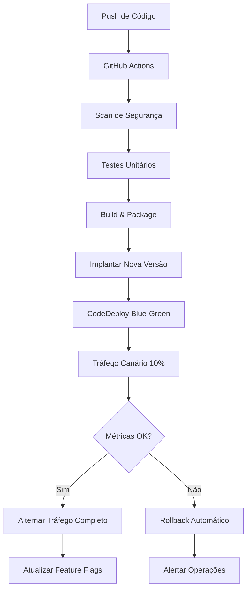

# Guia de Implantação e Rollback

## Visão Geral

Este guia cobre a estratégia de implantação blue-green implementada para a Plataforma de Dados ONS, incluindo releases canário, feature flags e procedimentos automatizados de rollback.

## Arquitetura

### Componentes de Implantação Blue-Green

1. **AWS CodeDeploy**: Gerencia implantações blue-green para funções Lambda
2. **AWS AppConfig**: Fornece feature flags e gerenciamento de configuração
3. **Alarmes CloudWatch**: Monitoram taxas de erro e latência para rollback automático
4. **GitHub Actions**: Pipeline CI/CD automatizado com triggers baseados em caminho

### Fluxo de Implantação



## Estratégias de Implantação

### 1. Implantação Canário (Padrão)

- **Divisão de Tráfego**: 10% para nova versão, 90% para versão atual
- **Duração**: 5 minutos de período de monitoramento
- **Triggers de Rollback**: 
  - Taxa de erro > 5%
  - Duração média > 10 segundos
  - Falhas de conexão InfluxDB
  - Alarmes CloudWatch

### 2. Implantação All-at-Once (Emergência)

- **Caso de Uso**: Correções críticas de bugs, patches de segurança
- **Divisão de Tráfego**: Alteração imediata 100%
- **Monitoramento**: Verificações contínuas de saúde

### 3. Implantação Linear

- **Divisão de Tráfego**: Aumento gradual (10%, 20%, 50%, 100%)
- **Duração**: 10 minutos por estágio
- **Caso de Uso**: Releases de funcionalidades principais

## Feature Flags

### Flags Disponíveis

1. **enable_new_api_endpoint**: Controla nova funcionalidade da API
2. **enable_enhanced_processing**: Recursos avançados de processamento de dados
3. **enable_advanced_monitoring**: Capacidades de monitoramento aprimoradas
4. **use_influxdb**: Controla uso do InfluxDB vs Timestream
5. **enable_flux_queries**: Habilita consultas Flux diretas

### Gerenciamento de Flags

```bash
# Habilitar feature flag
python scripts/deploy.py --action update-flag \
  --application-id app-12345 \
  --environment-id env-prod \
  --profile-id profile-flags \
  --flag-name enable_new_api_endpoint \
  --enabled true

# Desabilitar feature flag (emergência)
python scripts/rollback.py --action rollback-flags \
  --application-id app-12345 \
  --environment-id env-prod \
  --profile-id profile-flags \
  --flags enable_new_api_endpoint enable_enhanced_processing
```

## Procedimentos de Implantação

### Implantação Automatizada (Recomendada)

1. **Push para branch main** - Dispara implantação automática
2. **Monitorar GitHub Actions** - Verificar status do pipeline
3. **Verificar implantação** - Checar métricas CloudWatch
4. **Atualizar feature flags** - Habilitar novas funcionalidades gradualmente

### Implantação Manual

```bash
# Implantar função específica
python scripts/deploy.py \
  --function-name lambda_router \
  --version 5 \
  --deployment-group lambda_router-deployment-group \
  --canary-percentage 10 \
  --rollback-threshold 5

# Monitorar implantação
aws codedeploy get-deployment --deployment-id d-XXXXXXXXX

# Verificar saúde
python scripts/rollback.py --action health-check \
  --functions lambda_router structured_data_processor
```

## Procedimentos de Rollback

### Rollback Automático

Rollback automático é disparado quando:
- Taxa de erro excede 5%
- Tempo médio de resposta excede 10 segundos
- Alarmes CloudWatch são disparados
- Implantação falha

### Rollback Manual

#### 1. Rollback de Função de Emergência

```bash
# Rollback para versão anterior
python scripts/rollback.py --action rollback-function \
  --function-name lambda_router

# Rollback para versão específica
python scripts/rollback.py --action rollback-function \
  --function-name lambda_router \
  --target-version 4
```

#### 2. Parar Implantação Ativa

```bash
# Listar implantações ativas
aws codedeploy list-deployments \
  --application-name ons-data-platform-lambda-app \
  --include-only-statuses InProgress

# Parar implantação com rollback
python scripts/rollback.py --action stop-deployment \
  --deployment-id d-XXXXXXXXX
```

#### 3. Rollback de Feature Flag

```bash
# Desabilitar feature flags problemáticas
python scripts/rollback.py --action rollback-flags \
  --application-id app-12345 \
  --environment-id env-prod \
  --profile-id profile-flags \
  --flags enable_new_api_endpoint
```

## Monitoramento e Alertas

### Métricas Chave

1. **Taxa de Erro**: Erros de função Lambda / total de invocações
2. **Duração**: Tempo médio de resposta
3. **Throttles**: Eventos de throttling Lambda
4. **API Gateway**: Taxas de erro 4xx/5xx

### Alarmes CloudWatch

- **Taxa de Erro Lambda**: > 5% por 2 períodos consecutivos
- **Duração Lambda**: > 10 segundos em média
- **API Gateway 5xx**: > 1% de taxa de erro
- **Dead Letter Queue**: Mensagens presentes

### Notificações SNS

Alertas são enviados para equipe de operações para:
- Falhas de implantação
- Rollbacks automáticos
- Altas taxas de erro
- Degradação de performance

## Solução de Problemas

### Problemas Comuns

#### 1. Implantação Travada em Progresso

```bash
# Verificar status da implantação
aws codedeploy get-deployment --deployment-id d-XXXXXXXXX

# Verificar logs CloudWatch
aws logs describe-log-groups --log-group-name-prefix /aws/lambda/

# Forçar parada se necessário
python scripts/rollback.py --action stop-deployment \
  --deployment-id d-XXXXXXXXX
```

#### 2. Alta Taxa de Erro Após Implantação

```bash
# Verificar logs da função
aws logs filter-log-events \
  --log-group-name /aws/lambda/lambda_router \
  --start-time $(date -d '10 minutes ago' +%s)000

# Rollback imediato
python scripts/rollback.py --action rollback-function \
  --function-name lambda_router
```

#### 3. Feature Flag Não Fazendo Efeito

```bash
# Verificar status de implantação AppConfig
aws appconfig list-deployments \
  --application-id app-12345 \
  --environment-id env-prod

# Verificar configuração
aws appconfig get-configuration \
  --application app-12345 \
  --environment env-prod \
  --configuration profile-flags \
  --client-id troubleshooting
```

### Comandos de Verificação de Saúde

```bash
# Verificação abrangente de saúde
python scripts/rollback.py --action health-check \
  --functions lambda_router structured_data_processor rag_query_processor influxdb_loader timeseries_query_processor

# Verificação específica de saúde InfluxDB
python scripts/validate_influxdb_performance.py --health-check-only

# Verificação de saúde endpoint API
curl -X GET "https://api.ons-platform.com/health" \
  -H "x-api-key: SUA_CHAVE_API"

# Verificar conectividade InfluxDB
python -c "
from src.shared_utils.influxdb_client import InfluxDBHandler
handler = InfluxDBHandler()
print(handler.health_check())
"

# Verificar todas as implantações ativas
aws codedeploy list-deployments \
  --application-name ons-data-platform-lambda-app
```

## Melhores Práticas

### Pré-Implantação

1. **Executar testes abrangentes** no ambiente de desenvolvimento
2. **Revisar resultados de scan de segurança** do GitHub Actions
3. **Verificar mudanças de infraestrutura** com terraform plan
4. **Preparar plano de rollback** para implantações críticas

### Durante a Implantação

1. **Monitorar métricas CloudWatch** continuamente
2. **Verificar logs da aplicação** para erros
3. **Verificar se feature flags** estão funcionando corretamente
4. **Testar jornadas críticas do usuário** manualmente

### Pós-Implantação

1. **Monitorar por 24 horas** após releases principais
2. **Habilitar feature flags gradualmente** para nova funcionalidade
3. **Documentar quaisquer problemas** e lições aprendidas
4. **Atualizar runbooks** baseado na experiência

### Procedimentos de Emergência

1. **Manter scripts de rollback prontos** e testados
2. **Ter equipe de operações de sobreaviso** para releases principais
3. **Manter canais de comunicação** para resposta a incidentes
4. **Documentar todas as ações de emergência** para post-mortem

## Gerenciamento de Configuração

### Variáveis de Ambiente

```bash
# Desenvolvimento
export AWS_REGION=us-east-1
export APPCONFIG_APPLICATION_ID=app-dev-12345
export APPCONFIG_ENVIRONMENT_ID=env-dev-67890

# Produção
export AWS_REGION=us-east-1
export APPCONFIG_APPLICATION_ID=app-prod-12345
export APPCONFIG_ENVIRONMENT_ID=env-prod-67890
```

### Variáveis Terraform

```hcl
# terraform.tfvars
deployment_error_threshold = 5
deployment_duration_threshold = 10000
deployment_config_name = "CodeDeployDefault.LambdaCanary10Percent5Minutes"
deployment_notification_email = "ops-team@company.com"
```

## Considerações de Segurança

1. **Roles IAM**: Acesso de menor privilégio para CodeDeploy e AppConfig
2. **Criptografia**: Todas as configurações criptografadas em repouso e em trânsito
3. **Log de Auditoria**: Todas as ações de implantação logadas no CloudTrail
4. **Controle de Acesso**: Acesso baseado em roles para ferramentas de implantação
5. **Gerenciamento de Segredos**: Usar AWS Secrets Manager para dados sensíveis

## Otimização de Custos

1. **Triggers baseados em caminho**: Implantar apenas componentes alterados
2. **Instâncias spot**: Usar para processamento batch não crítico
3. **Políticas de lifecycle**: Limpeza automática de versões antigas
4. **Tagging de recursos**: Rastrear custos por componente e ambiente
5. **Monitoramento**: Configurar detecção de anomalias de custo e alertas

---

**Última Atualização**: $(date)
**Versão**: 2.0 (Pós-Migração InfluxDB)
**Próxima Revisão**: $(date -d '+1 month')