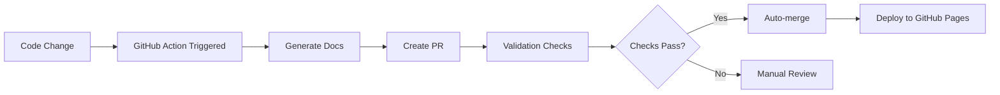

# Documentation Workflow Guide

## 🔄 How It Works

The documentation system automatically updates when you make code changes:

### 1. **Trigger Events**
- Push to `main` branch with changes to `src/` or `infra/`
- Pull request with code changes
- Manual workflow dispatch

### 2. **Automated Process**


### 3. **Branch Strategy**
- **Main Branch**: Never gets direct doc commits
- **Doc Branches**: `docs/auto-update-{run-number}`
- **Auto-merge**: Enabled for validated doc PRs
- **GitHub Pages**: Deployed from main after merge

## 📝 What Gets Generated

### API Documentation
- Extracted from Lambda function docstrings
- Includes parameters, return values, examples
- Auto-formatted as Markdown

### Component Documentation  
- Generated from source code comments
- Includes class/function descriptions
- Links to related components

### Infrastructure Documentation
- Parsed from Terraform files
- Resource descriptions and relationships
- Configuration examples

### Architecture Documentation
- System overview and data flow
- Component interactions
- Deployment architecture

## 🛠️ Manual Operations

### Generate Docs Locally
```bash
python scripts/generate_docs.py --project-root .
```

### Force Documentation Update
```bash
# Trigger workflow manually
gh workflow run generate-docs.yml
```

### Preview Documentation Site
```bash
# Install MkDocs
pip install mkdocs mkdocs-material

# Serve locally
mkdocs serve
# Visit http://localhost:8000
```

## 🔧 Troubleshooting

### Common Issues

**Documentation PR not auto-merging:**
- Check validation logs in GitHub Actions
- Ensure all required checks pass
- Verify PR has correct labels

**Missing documentation for new components:**
- Add docstrings to Python functions
- Include comments in Terraform files
- Run local generation to test

**Broken links in documentation:**
- Use relative paths for internal links
- Check file paths are correct
- Validate with local MkDocs build

### Manual Fixes

If auto-generation fails, you can:
1. Fix the source code comments/docstrings
2. Run local generation to test
3. Push fixes to trigger new PR
4. Manually edit docs (will be overwritten)

## 📋 Best Practices

### Writing Good Docstrings
```python
def process_energy_data(data: dict) -> dict:
    """
    Process raw energy consumption data into structured format.
    
    Args:
        data (dict): Raw energy data with timestamp and values
        
    Returns:
        dict: Processed data with normalized timestamps and validated values
        
    Raises:
        ValueError: If data format is invalid
        
    Example:
        >>> process_energy_data({"timestamp": "2024-01-01", "value": 100})
        {"timestamp": "2024-01-01T00:00:00Z", "value": 100.0}
    """
```

### Terraform Comments
```hcl
# CloudWatch Log Group for Lambda function monitoring
# Retention period set to 30 days for cost optimization
resource "aws_cloudwatch_log_group" "lambda_logs" {
  name              = "/aws/lambda/${var.function_name}"
  retention_in_days = 30
  
  tags = {
    Purpose = "Lambda function logging and debugging"
    Component = "monitoring"
  }
}
```

### Component Documentation
- Keep descriptions concise but complete
- Include usage examples where helpful
- Document configuration options
- Link to related components

## 🚀 Benefits

- **Always Up-to-Date**: Docs sync with code changes
- **No Manual Maintenance**: Automated generation and deployment
- **Consistent Format**: Standardized documentation structure
- **Version Control**: All changes tracked in Git
- **Review Process**: Documentation changes go through PR review
- **Live Site**: Always available documentation website